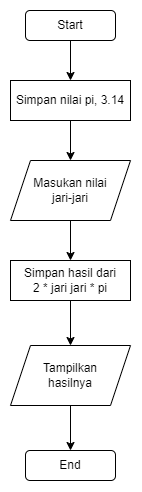

# Menghitung keliling sebuah lingkaran

## Algoritma
1. Simpan nilai pi-nya, 3.14
2. Masukan nilai jari-jari
3. Hitung 2 * jari-jari * 3.14(pi) dan simpan ke hasil
4. Tampilkan hasilnya

## pseudocode
DECLARE pi, jariJari, hasil AS INTEGER

pi = 3.14
jariJari = INPUT("Masukan nilai jari-jari:")

hasil = 2 * jariJari * pi

PRINT(hasil)

## flowchart

